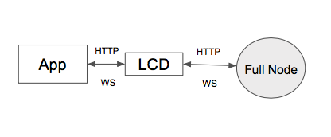

# Overview

## What is a Light Client?

 The LCD is split into two separate components. The first component is generic for any Tendermint based application. It handles the security and connectivity aspects of following the header chain and verify proofs from full nodes against locally trusted validator set. Furthermore it exposes exactly the same API as any Tendermint Core node. The second component is specific for the Cosmos Hub (Gaia). It works as a query endpoint and exposes the application specific functionality, which can be arbitrary. All queries against the application state have to go through the query endpoint. The advantage of the query endpoint is that it can verify the proofs that the application returns.

## High-Level Architecture

An application developer that would like to build a third party integration can ship his application with the LCD for the Cosmos Hub (or any other zone) and only needs to initialise it. Afterwards his application can interact with the zone as if it was running against a full node.

An application developer that wants to build an third party application for the Cosmos Hub (or any other zone) should build it against it's canonical API. That API is a combination of multiple parts. All zones have to expose ICS0 (TendermintAPI). Beyond that any zone is free to choose any combination of module APIs, depending on which modules the state machine uses. The Cosmos Hub will initially support ICS0 (TendermintAPI), ICS1 (KeyAPI), ICS20 (TokenAPI), ICS21 (StakingAPI) and ICS22 (GovernanceAPI).

All applications are expected to only run against the LCD. The LCD is the only piece of software that offers stability guarantees around the zone API.

### Comparision

A full node of ABCI is different from its light client in the following ways:

|| Full Node | LCD | Description|
|-| ------------- | ----- | -------------- |
| Execute and verify transactions|Yes|No|Full node will execute and verify all transactions while LCD won't|
| Verify and save blocks|Yes|No|Full node will verify and save all blocks while LCD won't|
| Participate consensus| Yes|No|Only when the full node is a validtor, it will participate consensus. LCD nodes never participate consensus|
| Bandwidth cost|Huge|Little|Full node will receive all blocks. if the bandwidth is limited, it will fall behind the main network. What's more, if it happens to be a validator,it will slow down the consensus process. LCD requires little bandwidth. Only when serving local request, it will cost bandwidth|
| Computing resource|Huge|Little|Full node will execute all transactions and verify all blocks which require much computing resource|
| Storage resource|Huge|Little|Full node will save all blocks and ABCI states. LCD just saves validator sets and some checkpoints|
| Power consume|Huge|Little|Full nodes have to be deployed on machines which have high performance and will be running all the time. So power consume will be huge. LCD can be deployed on the same machines as users' applications, or on independent machines but with poor performance. Besides, LCD can be shutdown anytime when necessary. So LCD only consume very little power, even mobile devices can meet the power requirement|
| Provide APIs|All cosmos APIs|Modular APIs|Full node supports all cosmos APIs. LCD provides modular APIs according to users' configuration|
| Secuity level| High|High|Full node will verify all transactions and blocks by itself. LCD can't do this, but it can query any data from other full nodes and verify the data independently. So both full node and LCD don't need to trust any third nodes, they all can achieve high security|

According to the above table, LCD can meet all users' functionality and security requirements, but only requires little resource on bandwidth, computing, storage and power.

## How does LCD achieve high security?

### Trusted validator set

The base design philosophy of lcd follows the two rules:

1. **Doesn't trust any blockchin nodes, including validator nodes and other full nodes**
2. **Only trusts the whole validator set**

The original trusted validator set should be prepositioned into its trust store, usually this validator set comes from genesis file. During running time, if LCD detects different validator set, it will verify it and save new validated validator set to trust store.

### Trust propagation

From the above section, we come to know how to get trusted validator set and how lcd keeps track of validator set evolution. Validator set is the foundation of trust, and the trust can propagate to other blockchain data, such as block and transaction. The propagate architecture is shown as follows:

In general, by trusted validator set, LCD can verify each block commit which contains all pre-commit data and block header data. Then the block hash, data hash and appHash are trusted. Based on this and merkle proof, all transactions data and ABCI states can be verified too. Detailed implementation will be posted on technical specification.
