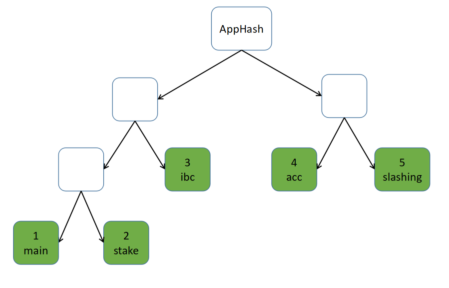
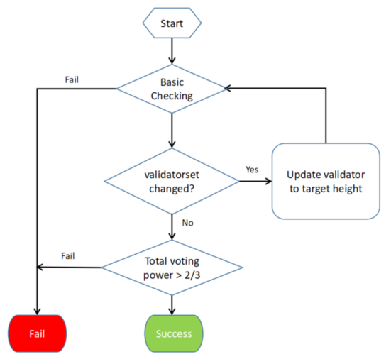

# Specifications

This specification describes how to implement the LCD. LCD supports modular APIs. Currently, only ICS1 (Key API),ICS20 (Token API) and ICS21 (Staking API) are supported. Later, if necessary, more APIs can be imported.

## Build and Verify Proof of ABCI States 

As we all know,  storage of cosmos-sdk based application contains multi substores. Each substore is implemented by an IAVL store. These substores are organized by simple Merkle tree. To build the tree, we need to extract name, height and store root hash from these substores' root nodes to build a set of simple Merkle leaf nodes, then calculate hash from leaf nodes to root. The root hash of the simple Merkle tree should equal to the AppHash which will be included in block header.



As we have discussed in [LCD trust-propagation](readme.md#how-does-lcd-achieve-high-security), the AppHash can be verified by checking voting power against a trusted validator set. Here we just need to build proof from ABCI state to AppHash.

IAVL proof is implemented by [IAVL library](https://github.com/tendermint/iavl). If the target key exists, it can demonstrate that the key and value definitely exist in the store. Otherwise, if the key absents, it will return absence proof. The absence proof is very tricky. It contains a set of existence proof for a range of sorted keys which should cover the target key. However, the target key is not in the set. So the target key must not exist.

```
type RangeProof struct {
	// You don't need the right path because
	// it can be derived from what we have.
	LeftPath   PathToLeaf      `json:"left_path"`
	InnerNodes []PathToLeaf    `json:"inner_nodes"`
	Leaves     []proofLeafNode `json:"leaves"`
	// memoize
	rootVerified bool
	rootHash     []byte // valid iff rootVerified is true
	treeEnd      bool   // valid iff rootVerified is true
}
```
Currently, the IAVL proof data structure is shown as above. It describes the ways from the root node to leave nodes. However, in cosmos, multi stores are implemented and each store has its root node. As we have discussed above, the AppHash are based on all these root nodes. So it is necessary to add some fields in the IAVL proof to describe how to build the simple Merkle tree from these root nodes.

```
type SubstoreCommitID struct {
	Name string `json:"name"`
	Version int64 `json:"version"`
	CommitHash    cmn.HexBytes `json:"commit_hash"`
}

type RangeProof struct {
	MultiStoreCommitInfo []SubstoreCommitID `json:"multi_store_commit_info"`
	StoreName string `json:"store_name"`
	// You don't need the right path because
	// it can be derived from what we have.
	LeftPath   PathToLeaf      `json:"left_path"`
	InnerNodes []PathToLeaf    `json:"inner_nodes"`
	Leaves     []proofLeafNode `json:"leaves"`
	// memoize
	rootVerified bool
	rootHash     []byte // valid iff rootVerified is true
	treeEnd      bool   // valid iff rootVerified is true
}
```
The above data structure has two new fields: StoreName and MultiStoreCommitInfo. The StoreName is the store name of current proof. The MultiStoreCommitInfo contains all root nodes' information at specific height. Steps to verify the proof against AppHash:

* 1. Rebuild the simple Merkle tree and verify if the root hash equals to AppHash, if not equal, the proof is invalid
* 2. Iterate MultiStoreCommitInfo to find the root commit hash by store name
* 3. Verify the proof against the found root commit hash.

The code which implements the above steps locates in [proof verification](https://github.com/irisnet/cosmos-sdk/blob/haoyang/lcd-dev/store/multistoreproof.go)

2. **Verify block header against validator set**

Above sections refer appHash frequently. But where does the trusted appHash come from? Actually, appHash exist in block header, so next we need to verify blocks header at specific height against LCD trusted validator set. The validation flow is shown as follows:



When the trusted validator set doesn't match the block header, we need to try to update our validator set to the height of this block. LCD have a rule that each validator set change should not affact more than 1/3 voting power. Compare with the trusted validator set, if the voting power of target validator set changes more than 1/3. We have to verify if there are hidden validator set change before the target validator set. Only when all validator set changes obey this rule, can our validator set update be accomplished.

For instance:


* Update to 10000, tooMuchChangeErr
* Update to 5050,  tooMuchChangeErr
* Update to 2575, Success
* Update to 5050, Success
* Update to 10000,tooMuchChangeErr
* Update to 7525, Success
* Update to 10000, Success

## Load Balancing

To improve LCD reliability and TPS, we recommend to connect LCD to more than one fullnode. But the complexity will increase a lot. So load balancing module will be imported as the adapter. Please refer to this link for detailed description: [load balancing](loadbalance.md)

## ICS1 (KeyAPI)

1. **Query keys, [API introduction](api.md#ics19keys---get)**
	* a. Load key store

   	 ```
	db, err := dbm.NewGoLevelDB(KeyDBName, filepath.Join(rootDir, "keys"))
	if err != nil {
		return nil, err
	}
	keybase = client.GetKeyBase(db)
    ```

	* b. Iterate the whole key store

    ```
	var res []Info
	iter := kb.db.Iterator(nil, nil)
	defer iter.Close()
	for ; iter.Valid(); iter.Next() {
		// key := iter.Key()
		info, err := readInfo(iter.Value())
		if err != nil {
			return nil, err
		}
		res = append(res, info)
	}
	return res, nil
    ```

	* c. Encode address and public key to bech32 pattern

	```
	bechAccount, err := sdk.Bech32ifyAcc(sdk.Address(info.PubKey.Address().Bytes()))
	if err != nil {
		return KeyOutput{}, err
	}
	bechPubKey, err := sdk.Bech32ifyAccPub(info.PubKey)
	if err != nil {
		return KeyOutput{}, err
	}
	return KeyOutput{
		Name:    info.Name,
		Address: bechAccount,
		PubKey:  bechPubKey,
	}, nil
    ```

2. **Import key, [API introduction](api.md#ics19keys---post)**

	* a. Load key store
	* b. Parameter checking. Name, password and seed should not be empty
	* c. Key name duplication checking
	* d. Build key from key name, password and seed
	* e. Persist key to key store

3. **Generate seed, [API introduction](api.md#ics19keysseed---get)**

	* a. Load mock key store to avoid key persistence
	* b. Generate random seed and return

4. **Get key info by key name, [API introduction](api.md#ics19keysgetname---get)**

	* a. Load key store
	* b. Iterate the whole key store to find the key by name
	* c. Encode address and public key to bech32 pattern

5. **Update key password, [API introduction](api.md#ics19keysname---put)**

	* a. Load key store
	* b. Iterate the whole key store to find the key by name
	* c. Verify if the old-password match the current key password
	* d. Re-persist the key with new password

6. **Delete key, [API introduction](api.md#ics19keysname---delete)**

	* a. Load key store
	* b. Iterate the whole key store to find the key by name
	* c. Verify if the specified password match the current key password
	* d. Delete the key from key store

## ICS20 (TokenAPI)

1. **Query asset information for specified account, [API introduction](api.md#ics20balanceaccount---get)**

	* a. Decode address from bech32 to hex
	* b. Send query request to a full node. Assert proof required in the request if LCD works on no-trust mode
	* c. Verify the proof against trusted validator set

2. **Build unsigned transaction for transferring asset, [API introduction](api.md#ics20create_transfer---post)**

	* a. Parameter checking
	* b. Build transaction with user specified parameters
	* c. Serialize the transaction and return the byte array

3. **Broadcast signed transaction for transferring asset, [API introduction](api.md#ics20signed_transfer---post)**

	* a. Users are supposed to sign the transaction byte array with their private key
	* b. Broadcast transaction and its signature to full node
	* c. Wait until the transaction is on chain and return the transaction hash

## ICS21 (StakingAPI)

1. **Get all validators' detailed information, [API introduction](api.md#stakevalidators---get)**

	* a. Send query request to a full node
	* b. Decode the query result and return

2. **Get and verify the delegation information, [API introduction](api.md#stakedelegatorbonding_statusvalidator---get)**

	* a. Verify and decode delegator address and validator address
	* b. Send query request to a full node. Assert proof required in the request if LCD works on no-trust mode
	* c. Verify the proof against trusted validator set
